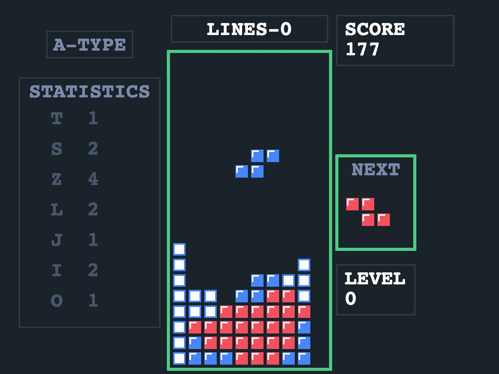

# React Tetris Game

## Control

* UP - rotate figure (tetromino)
* DOWN - soft drop
* RIGHT/LEFT - move
* ENTER - start again

## Known problems

- Figures start position is too low. Some figures (which have first empty line) appears lower then expected.
- Fix-delay depends on speed. No time to move or rotate when soft drop.
- No pause.
- No music.
- No touch control.

## Keywords

JavaScript, TypeScript, React, Konva, ReactKonva, Sound, Beep, Canvas, animation, game
